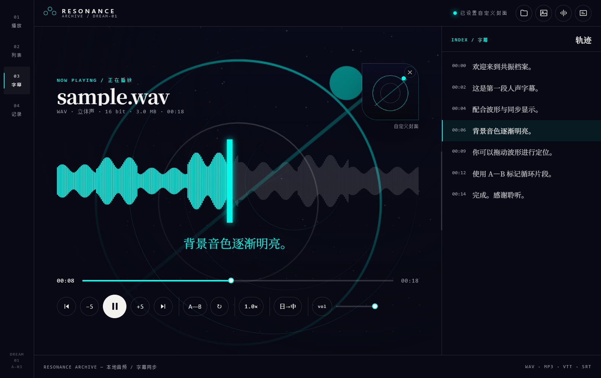
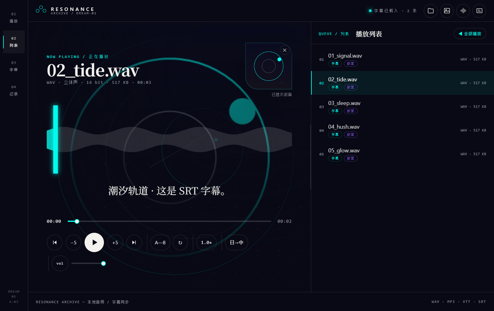
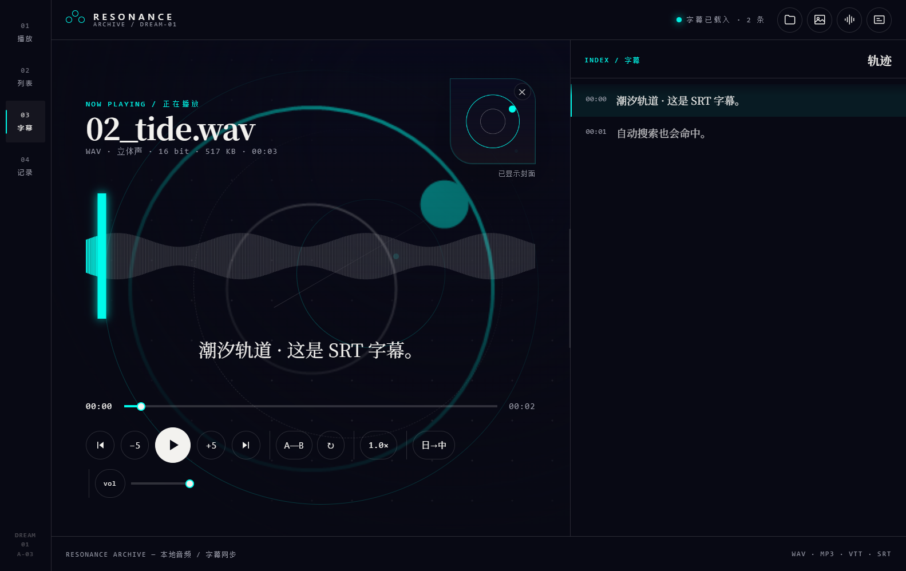
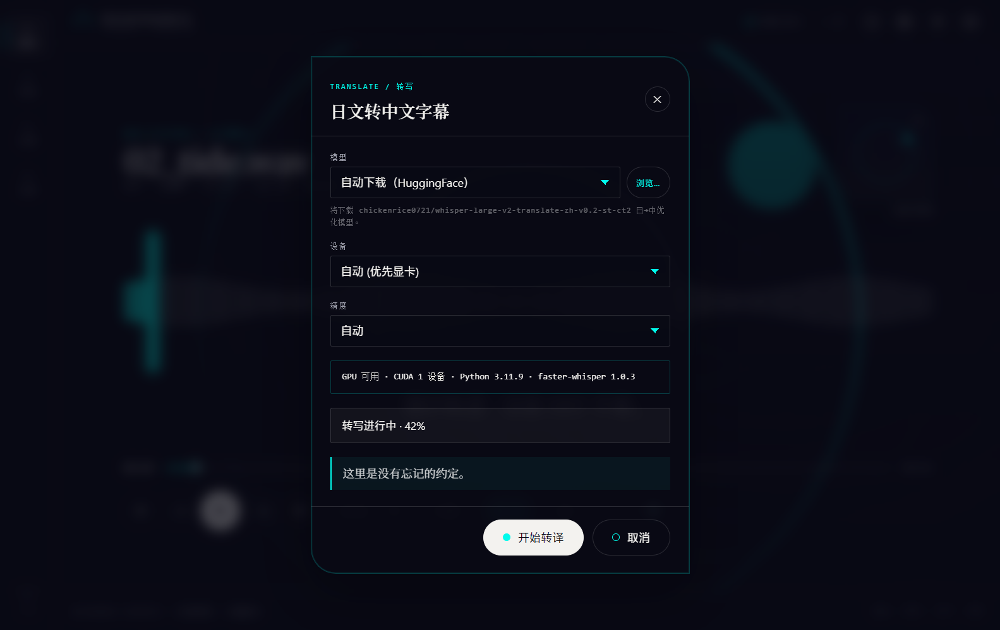
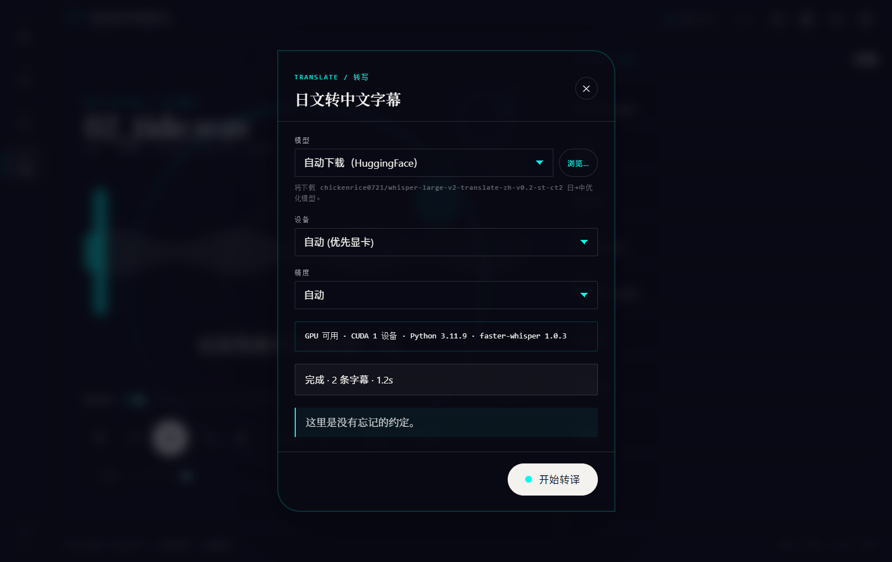
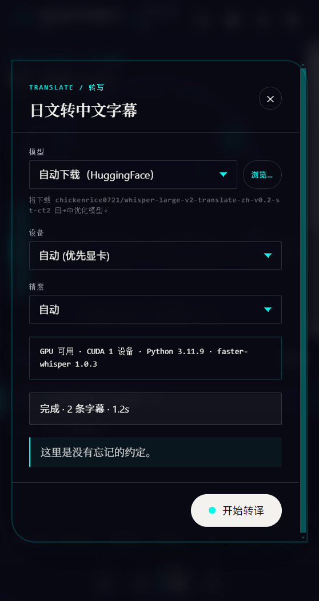

# WAV 播放器（WAV Player）

**一个本地 WAV 播放器：同步 VTT 字幕，并支持日文 → 中文转写。**

`WAV Player` 是一个基于 Electron 的桌面播放器，用于播放本地 `.wav` 音频、同步显示 `.vtt` 字幕，并可将日语 ASMR 音频在 **本地** 转写为中文字幕。

<p>
  
  
  
  
</p>

---

## 截图 / Screenshots

<table>
  <tr>
    <td></td>
    <td></td>
  </tr>
  <tr>
    <td align="center">播放器 + 字幕同步</td>
    <td align="center">文件夹播放列表（侧栏可调宽）</td>
  </tr>
  <tr>
    <td></td>
    <td></td>
  </tr>
  <tr>
    <td align="center">字幕 / 轨迹索引面板</td>
    <td align="center">日→中 本地转写弹窗</td>
  </tr>
  <tr>
    <td></td>
    <td></td>
  </tr>
  <tr>
    <td align="center">文件档案面板</td>
    <td align="center">竖向 / 窄屏重排</td>
  </tr>
</table>

## 特性 / Features

- **本地 WAV 播放**：Web Audio 解码生成真实波形峰值，点击 / 拖动波形可定位。
- **同步字幕**：`.vtt` 解析（兼容常见内联标签与 SRT），与播放进度精确同步并自动滚动。
- **文件夹播放列表**：递归扫描整个文件夹，自动生成列表（支持子目录），一键“全部播放”。
- **自动关联字幕与封面（宽松匹配）**：
  - 同名 `.vtt` / `.srt`、子目录（`subtitle/subtitles/subs/lyrics/…`）、大小写 / 分隔符不敏感匹配。
  - 支持把字幕追加到完整音频文件名（如 `01.xxx.wav` → `01.xxx.wav.vtt`）。
  - 封面：同名图片、`cover/folder/front/album/…` 通用名、封面子目录，整专辑回退到封面。
- **自定义封面**：点击封面卡片更换、点 ✕ 移除，按音频记住；封面同时作为舞台掩幕背景。
- **内嵌封面**：没有外部封面图时，自动从音频文件读取内嵌封面（ID3v2 APIC / FLAC PICTURE / MP4 `covr` / OGG base64），列表与播放器都会显示。
- **专辑文件夹管理**：把常用文件夹收藏成“专辑库”，一键切换 / 设置专辑封面（整张专辑共用）/ 从列表移除（不删文件）。
- **记住播放进度 + 上次队列**：每首曲目单独记忆播放位置，重启后自动恢复上次的文件夹、曲目与进度。
- **日文转中文字幕（本地推理）**：
  - 基于 Faster-Whisper（CTranslate2）+ 海南鸡 v2 日→中优化模型。
  - 在 **本地 GPU（NVIDIA CUDA）** 或 CPU 上转写，输出 `.wav.zh.vtt` 并自动载入。
  - 设备自动探测（检测到 CUDA 则默认 `cuda` + `int8_float16`，否则 `cpu` + `int8`）。
  - **批量转写整个文件夹**：模型只加载一次，逐个转写并显示队列进度；可勾选“跳过已有中文字幕”。
  - 可选 **人声检测（VAD）**、输出格式（VTT / SRT），进度 / 当前片段实时回显，可随时取消。
  - 进度 / 当前片段实时回显，可随时取消；生成的 `.zh.vtt` 会被自动字幕搜索识别。
- **播放控制**：A—B 循环、单曲循环、倍速、音量、跳转。
- **响应式**：桌面 / 竖向重排，遵循 `prefers-reduced-motion`。

## 技术栈 / Tech Stack

| 层 | 技术 |
| --- | --- |
| 桌面壳 | Electron 33 |
| 前端 | 原生 HTML / CSS / JS（无框架） |
| 视觉 | ark-ui Ex Astris（exa）`complex` |
| 字幕 | 自定义 WebVTT 解析器 |
| 语音转写 | Faster-Whisper `1.x` + CTranslate2 `4.x` |
| 转写模型 | `chickenrice0721/whisper-large-v2-translate-zh-v0.2-st-ct2` |

## 环境要求 / Requirements

- **Node.js 18+** 与 npm。
- **Python 3.11**（推荐；转写需要）。其他 3.10 / 3.12 也可，需自行确认轮子可用。
- **（可选）NVIDIA 显卡 + CUDA** 用于 GPU 推理。RTX 30 系建议 `CUDA 11.8 / 12.x`。

## 快速开始 / Quick Start

```bash
npm install
npm start        # 本地运行 Electron
```

打开后：

1. 点击顶栏 **载入文件夹**（或空态按钮），选择含 `.wav` 的文件夹 → 自动生成播放列表并自动关联字幕 / 封面。
2. 也可用 **拖放** 直接把 `.wav` / `.vtt` / `.srt` / 封面图片拖进窗口。
3. 点击播放，字幕随进度同步高亮；右侧 **字幕** 面板同步定位。

## 日文转中文字幕 / JP → ZH Transcription

这是本项目最特别的功能：把日语音频在 **本地** 转写为中文字幕，无需云端。

### 1. 安装 Python 依赖

```bash
py -3.11 -m pip install faster-whisper
```

如需 GPU 推理，再安装 CUDA 运行库（应用会自动把其 DLL 目录加入搜索路径）：

```bash
py -3.11 -m pip install nvidia-cudnn-cu12 nvidia-cublas-cu12
```

> 缺依赖时，转写弹窗会给出提示，软件不会崩溃。

### 2. 下载模型（约 3 GB）

在播放音频后点击播放条上的 **日→中**（或菜单 `文件 → 日文转中文…`，快捷键 `Ctrl+Shift+T`）：

- 默认“自动下载（HuggingFace）”会下载到 `models\`（开发时）或 `app.asar.unpacked\models\`（解包版）。
- 或点 **浏览…** 选择已有的模型目录，例如 `models\whisper-large-v2-translate-zh-v0.2-st-ct2`。

之后切换为“本地模型目录”即可离线复用（已下载则不再联网）。

### 3. 参数说明

| 参数 | 说明 |
| --- | --- |
| 范围 | **当前曲目** 或 **整个文件夹**（批量，模型只加载一次） |
| 设备 | 自动（优先显卡）/ GPU (CUDA) / CPU |
| 精度 | 自动 / `int8_float16`（8GB 显存友好）/ `float16` / `int8` |
| 格式 | `VTT` 或 `SRT` |
| 人声检测 | VAD，静音较多的 ASMR 时间轴更准 |
| 跳过已有中文字幕 | 批量时只转还没有 `.zh.vtt` 的曲目 |

批量模式下会显示逐曲队列与状态（等待 / 百分比 / 完成 / 跳过 / 失败），整体进度实时更新。完成后自动生成 `<音频名>.wav.zh.vtt` 并载入；自动字幕搜索会识别 `.zh.vtt` 对应的中文字幕。

## 快捷键 / Shortcuts

| 键 | 作用 |
| --- | --- |
| `空格` | 播放 / 暂停 |
| `←` / `→` | 后退 / 前进 5 秒 |
| `↑` / `↓` | 音量 + / − |
| `PageUp` / `PageDown` | 上一曲 / 下一曲 |
| `A` | 设置 / 取消 A—B 循环 |
| `L` | 单曲循环 |
| `M` | 静音 |
| `Home` / `End` | 跳到开头 / 结尾 |
| `Ctrl+Shift+T` | 打开日→中 转写 |

## 打包 / Packaging

```bash
npm run pack          # 生成解包版: dist\win-unpacked\WAV Player.exe
npm run pack:portable # (可选) 便携版
```

> `win.signAndEditExecutable` 已设为 `false`，因此 `electron-builder` 不会自动嵌入图标；如需给解包版 exe 加图标，可在本机安装 [rcedit](https://github.com/electron/rcedit) 后执行：
>
> ```bash
> rcedit-x64.exe "dist\win-unpacked\WAV Player.exe" --set-icon "dist\.icon-ico\icon.ico" --set-version-string "ProductName" "WAV Player"
> ```
>
> 不要对便携版 exe 使用 `rcedit`（NSIS 便携 stub 会剥离内嵌数据）。

## 项目结构 / Structure

```text
.
├── main.js            # Electron 主进程（IPC / 媒体协议 / 菜单）
├── preload.js         # contextBridge API
├── library.js         # 文件夹扫描 / 字幕 / 封面匹配
├── embedded-cover.js  # 读取音频内嵌封面（ID3 / FLAC / MP4 / OGG）
├── transcribe.js      # 转写任务：Python 探测、子进程、进度转发
├── transcribe.py      # 日→中 转写桥接（Faster-Whisper / CTranslate2）
├── renderer/          # 前端（index.html / app.js / styles.css / vtt.js）
├── build/             # 打包图标
├── screenshots/       # README 截图
├── samples/           # 示例音频 / 字幕 / 封面
├── test/              # QA 截图与端到端脚本
└── package.json
```

## 专辑 / 进度记忆 / 内嵌封面

- **专辑库**：左侧 **专辑** 视图汇总你载入过的文件夹；点卡片即切换（保留上次进度），卡片右侧可 **设封面**（整张专辑共用）或 **从列表移除**（不会删除文件）。
- **播放进度与队列**：关闭再打开后会自动恢复上一次的文件夹、曲目与播放位置（每首曲目单独记忆）。切歌时也会记住各自的位置。
- **内嵌封面**：当目录下没有 `cover.*` 等图片时，会从音频标签里提取内嵌封面并缓存到用户目录，列表缩略图与播放器封面都会使用它。

## 测试 / Tests

```bash
npm test     # 内嵌封面解析单测（ID3v2 / FLAC / MP4）
```

## 许可证 / License

[MIT](./LICENSE)

